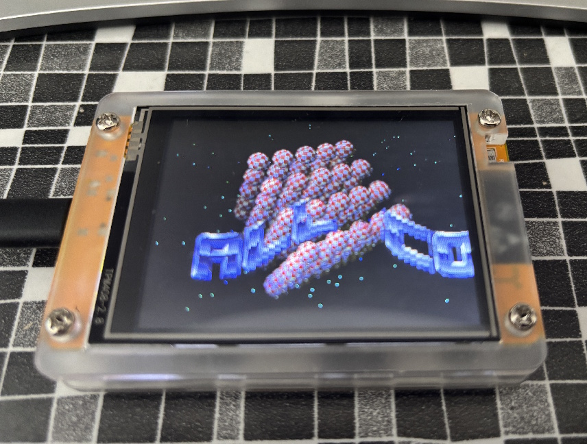

# Megademo

A collection of classic demo effects (starfield, vectorballs, scroller, image rotation) for a LovyanGFX-compatible display on Arduino-based hardware.

## Features
- Starfield simulation
- Vectorballs animation
- Scrolling text banners
- Image rotation effect

## Hardware Requirements
- ESP32 or compatible Arduino board
- LovyanGFX-compatible TFT display (e.g., ILI9341, ST7789, etc.)
- Wiring for display and optional LEDs (see pin definitions in `megademo.ino`)

## Getting Started
1. **Clone this repository**
2. **Install dependencies:**
   - [LovyanGFX library](https://github.com/lovyan03/LovyanGFX)
   - Arduino core for your board (e.g., ESP32)
3. **Open `megademo.ino` in the Arduino IDE**
4. **Adjust pin definitions** in `megademo.ino` if needed for your hardware
5. **Upload to your board**

## Pin Definitions (I'm using a CYD, TFT is autodetected by LovyanGFX)
- `LED_BLUE`   : GPIO 16
- `LED_RED`    : GPIO 4
- `LED_GREEN`  : GPIO 17
- `LED_BACKLIGHT`: GPIO 21

## Demo Effects Source
The algorithms for these effects are sourced from: [flightcrank/demo-effects](https://github.com/flightcrank/demo-effects)

## Screenshots

### Demo Video

## License
This project is for educational and demonstration purposes. See [flightcrank/demo-effects](https://github.com/flightcrank/demo-effects) for original effect code licensing. 